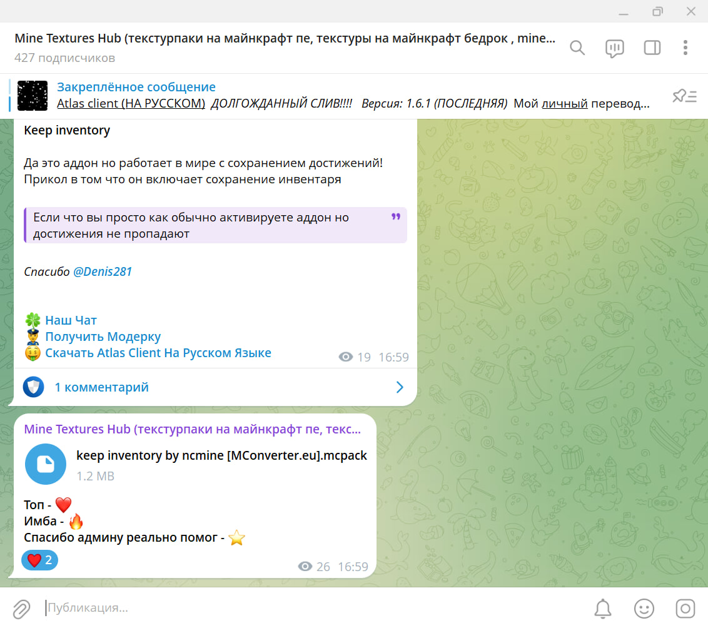
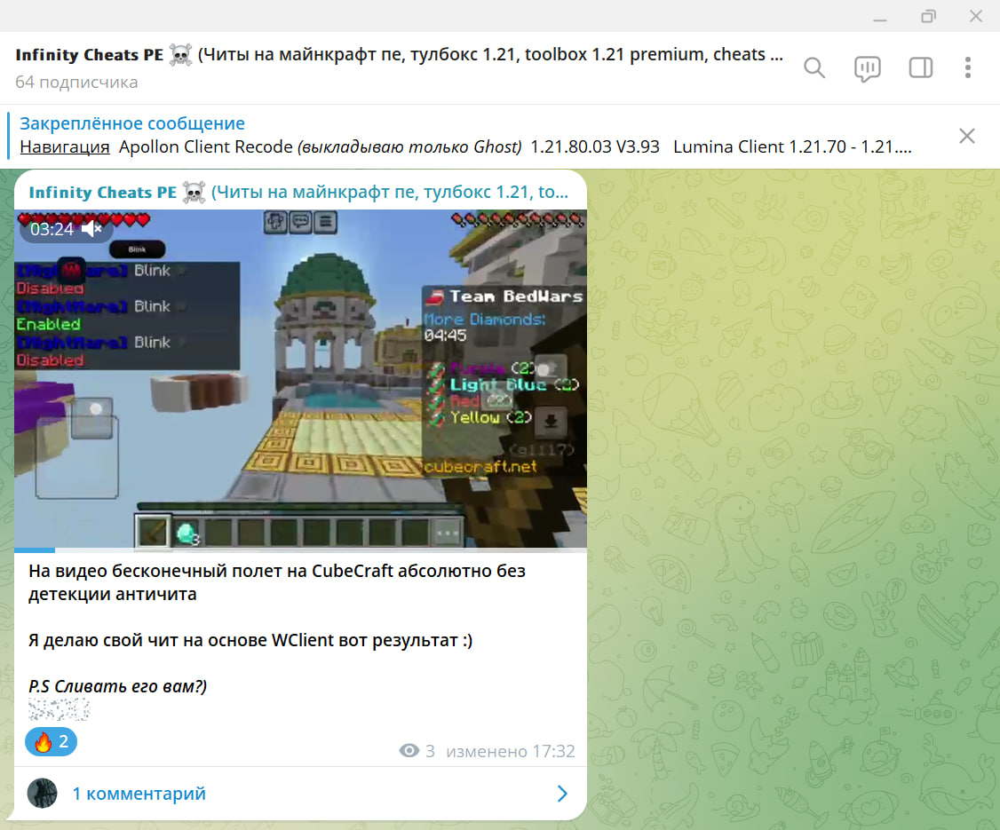

# 📱 Мои Telegram-проекты

Привет! Меня зовут Никита, и я веду два Telegram-канала и одного полезного Telegram-бота. Все проекты я развивал самостоятельно, полностью **без рекламы**, только за счёт контента, интереса аудитории и регулярной активности.

---

## 🎨 @minetextureshub – текстурпаки для Minecraft PE  
**📅 Дата запуска:** 31 декабря 2024  
**👥 Подписчиков:** >320  
**🔗 Ссылка:** [t.me/minetextureshub](https://t.me/minetextureshub)

### Что я делаю:
- Публикую эксклюзивные и популярные текстурпаки
- Провожу регулярные розыгрыши
- Взаимодействую с подписчиками (опросы, фидбек)
- Оформляю посты, баннеры и визуал

---

## 🛠️ @infinitycheatsmcpe – Minecraft PE читы  
**📅 Дата запуска:** 16 мая 2025  
**👥 Подписчиков:** >60  
**🔗 Ссылка:** [t.me/infinitycheatsmcpe](https://t.me/infinitycheatsmcpe)

### Что я делаю:
- Публикую приватные и открытые читы
- Провожу тестирование и отбор
- Обеспечиваю стабильный релиз и обратную связь

---

## 🤖 @BestUtilitesBot — Telegram-бот с утилитами  
**Язык:** Python (библиотека: `python-telegram-bot`)  
**Хостинг:** Render.com (работает 24/7)

### Что умеет бот:
- 🧪 Генератор UUID и текста Zalgo
- 🔐 Шифратор и дешифратор (в том числе Unicode)
- 📦 Анализатор ZIP-архивов с возможностью экспорта
- 🧹 Умное удаление переносов
- 🎭 Обфускация и деобфускация текстурпаков Minecraft
- и многое другое

---

## 🧠 Навыки:
- **Языки программирования:** HTML, основы Python  
- **Работа с ботами:** `python-telegram-bot`, размещение на Render  
- **Работа с Telegram:** администрирование, контент, аналитика  
- **Языки:** свободно говорю на сербском (и конечно Русском :)) языке  
- **Музыка:** играю на фортепиано и кларнете (в будущем – саксофон)  
- **Возраст:** 13 лет  
- **Страна:** Черногория

---

## 📈 Результаты:
- 🎯 Развитие каналов без рекламы
- 📈 Прирост подписчиков органически
- ⏱ 100% самостоятельное администрирование и поддержка

---

## 📷 Фото каналов:

